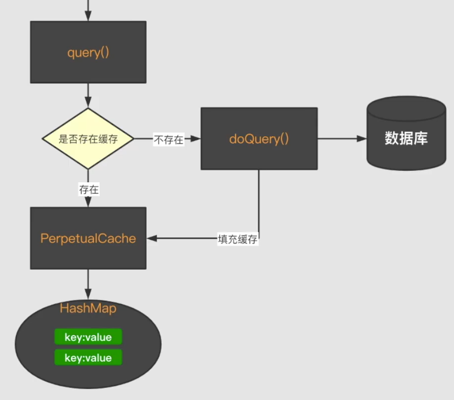

# 一级缓存
## 一级缓存命中条件
### 运行时参数相关
当中间没有对缓存进行操作时，需满足以下四个条件：
- 会话必须一样（所以一级缓存也叫会话级的缓存，缓存的数据也是保存到会话的生命周期里面）
- 必须是相同的StatementID
- sql和参数必须相同
- RowBounds返回行范围必须相同（没指定的时候，底层用的是RowBounds.DEFAULT 默认不分页）
### 操作与配置相关
哪些操作会导致缓存无法命中呢？参考BaseExecutor的clearLocalCache方法，看都被哪里调用到，大概对应有以下几点：
- 手动清空缓存（clearCache、commit、rollback）
- 执行有flushCache=true的查询
- 执行update类型的操作（即使里面的sql是select语句）
- 缓存的作用域改成STATEMENT，它只能通过全局的参数去修改（详见[Configuration](../src/main/java/org/apache/ibatis/session/Configuration.java)的localCacheScope属性）
> 缓存作用域为STATEMENT的时候，缓存是在哪里被使用？比如会作用到嵌套查询（例如子查询里面引用了父类的parentId）

## 源码流程

结合上图，对[BaseExecutor](../src/main/java/org/apache/ibatis/executor/BaseExecutor.java)的query方法参考注释进行阅读。

