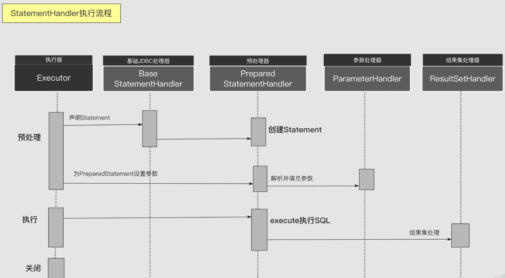

# StatementHandler
## 定义
JDBC处理器，基于JDBC构建Statement并设置参数，然后执行Sql，每调用会话当中一次Sql，都会有与之对应的且唯一的Statement实例。
## 代码结构
首先有个[StatementHandler](../src/main/java/org/apache/ibatis/executor/statement/StatementHandler.java)接口，主要提供的方法有：
- 声明Statement（创建、预处理Statement，总之都是调用JDBC的Connection里API里的方法）
- 设置参数
- 查询
- 修改

StatementHandler有三个实现，SimpleStatementHandler（简单处理器）、PreparedStatementHandler（预处理器）、
CallableStatementHandler（存储过程处理器）。而和Executor很像的是StatementHandler和上述三者之间有一个抽象类的
实现[BaseStatementHandler](../src/main/java/org/apache/ibatis/executor/statement/BaseStatementHandler.java)，以处理他们公共的逻辑。
Statement（爷爷）——>PreparedStatement（父亲）——>CallableStatement（我），都是一个继承的关系。在实际使用上，
百分之九十九都是使用的PreparedStatementHandler，因为用预处理的Statement性能更高，而且更安全（比如它里面会对Sql参数进行转义，有效防止Sql注入）。

## StatementHandler执行流程
关于Mybatis对数据库数据操作的流程：
1. 执行
2. 预编译
3. 设置参数
4. 执行JDBC
5. 结果映射成JAVA Bean

而关于StatementHandler操作的部分，如下图：

- 第一条线是创建Statement
- 第二条线设置参数（其中Parameter会将Java对象转成JDBC需要的参数形式）
- 第三条线执行并处理结果（其中ResultSet会将结果集转成对应的JavaBean，最为复杂）
详见代码[PreparedStatementHandler](../src/main/java/org/apache/ibatis/executor/statement/PreparedStatementHandler.java)
PrepareStatementHandler
## 参数转换

用ParamNameResolver进行参数转换：
1. 单个参数
    1. 默认不做任何处理，除非设置了@param
2. 多个参数（转换成Map）
    1. 转换成param1、param2
    2. 基于@Param中的name属性转换
    3. 基于反射转换成变量名，如果不支持转换成arg0，arg1
> 注：关于反射获取变量名，只有jdk1.8以后 并且添加了-parameters编译参数才可以。但不建议这么做，一旦编译的时候没加这个参数，
> 就会导致业务逻辑都会出现错误，编译的场所会有很多，可能在我本机，可能在Jenkins或者在一些第三方的编译服务器上，在这过程中若任何一个地方忘记
> 加上该参数，就会导致业务逻辑出错。